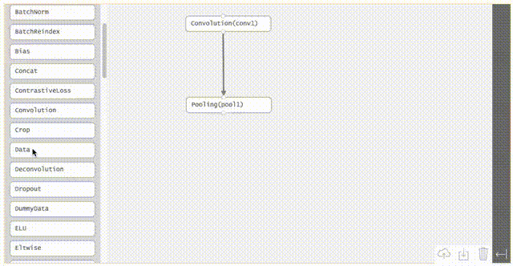

# dagstudio
Directed Acyclic Graph Studio with Javascript D3
Create nodes and links in a graph with an intuitive interface.

_Under development! The UI is working but no .prototxt import or export yet._

The intent is using this to create an interactive and intuitive dag creator for making graphs for ml frameworks.

## Caffe
All possible caffe layers should be obtained in a list (https://github.com/BVLC/caffe), after that you can just chain them through 'top' and 'bottom' keys.

## Torch
Torch _seems_ straightforward, although listing the layers is easy, I'm unsure how to obtain the possible arguments per layer. There are also some snags with concatenations and splits.

## Tensorflow
Maybe some minor support for TF-slim?